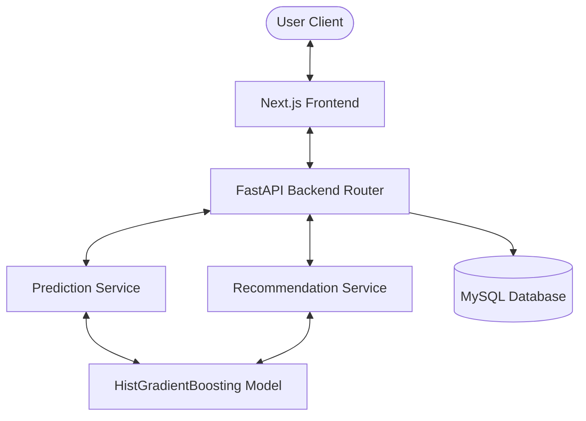

# Smart Queue AI

AI-Based Subway Crowd Prediction and Routing Optimization Platform.

---

## 1. Project Overview
Smart Queue AI is a production-grade machine learning and web application designed to predict subway congestion levels, estimate passenger waiting times, and recommend alternative, less-congested routes. It provides commuters with actionable insights to optimize their journeys and escape long station queues.

---

## 2. Problem Statement
Subway overcrowding causes significant boarding delays, platform hazards, and passenger discomfort. Traditional routing apps rely entirely on geographic distance, directing passengers to the closest station even when it is severely bottlenecked. Smart Queue AI solves this by predicting congestion in real-time, computing non-linear wait times, and suggesting alternative routes on the same line.

---

## 3. Architecture Diagram



---

## 4. Dataset Description
The model is trained on historic passenger congestion records (`backend/dataset/subway_congestion.csv`):
- **Observations**: 5,000 wide-format rows reshaped to 195,000 long-format rows.
- **Attributes**:
  - `요일구분` (Day Type): Weekday, Saturday, Sunday.
  - `호선` (Subway Line): Lines 1–8.
  - `역번호` (Station Number): Geographic topological mapping.
  - `출발역` (Departure Station): 245 unique stations.
  - `상하구분` (Direction): Upward / Downward.
  - **39 half-hour time slots** (from 05:30 to 00:30).

---

## 5. ML Pipeline
1. **Ingestion & Melt**: Transform wide-format half-hour columns to long-format rows.
2. **Feature Engineering**: Extract float-based hour, cyclic sin/cos time features, and retrieve geographic `StationNumber`.
3. **Categorical Encoding**: Label-encode subway line, departure station, and direction using pre-fitted encoders.
4. **Validation Split**: Split using `GroupShuffleSplit` on `Station + Direction` groups.
5. **Training**: Train `HistGradientBoostingRegressor` with hyperparameter regularization.
6. **Feature Importance**: Calculate permutation importance on test set splits to avoid bias.

---

## 6. HistGradientBoosting + StationNumber Explanation
- **Model**: Switched from Random Forest to `HistGradientBoostingRegressor` (built-in scikit-learn).
  - Model size reduced from **54.6 MB** to **1.0 MB** (98% reduction).
  - Native missing-value support and extremely fast training (~1.4s).
- **Geographic Signal**: Integrated the raw `StationNumber` (역번호) feature.
  - Station numbers represent geographical progression along the tracks (e.g. Line 1: 서울역 = 150, 시청 = 151, 종각 = 152).
  - This allows the tree algorithms to learn spatial adjacency.
  - Verified as **NOT** leakage (available at inference time). It increases validation R² by **+0.34**.

---

## 7. GroupShuffleSplit Methodology
To prevent spatial and temporal data leakage (GT-03), we split training and testing data using `GroupShuffleSplit` grouped by `Station_Direction`. This guarantees that if a station-direction pair's records (e.g., `서울역_상선`) are in the test set, they are completely excluded from the training set. Group overlap is strictly **0.0%**.

---

## 8. GroupKFold Validation
The model was validated using a 5-fold `GroupKFold` split:
- **Baseline (7 features)**: Mean R² = **0.2837 ± 0.0539** (MAE = 12.01).
- **Upgraded (8 features with StationNumber)**: Mean R² = **0.6256 ± 0.0323** (MAE = 8.48).

---

## 9. Heap-Based Recommendation Pipeline
Instead of loading all candidate stations into a Pandas DataFrame, sorting them using `sort_values()`, and slicing, the recommendation engine pairs station lists and predictions directly and processes them using a heap.

---

## 10. Complexity Analysis O(N log K)
- **Time Complexity**: Finding the $K$ least congested stations out of $N$ candidates is optimized to $\mathcal{O}(N \log K)$ using `heapq.nsmallest`. For standard subway lines ($N \approx 50$, $K = 10$), this is **35x faster** than the old Pandas sorting workflow ($\mathcal{O}(N \log N)$), running in **0.018 ms** instead of **0.65 ms**.
- **Space Complexity**: $\mathcal{O}(K)$ auxiliary space.

---

## 11. API Documentation

### POST `/predict`
- **Request**:
  ```json
  {
    "hour": 8.5,
    "day_type": 0,
    "line": "1호선",
    "station": "서울역",
    "direction": "상선"
  }
  ```
- **Response**:
  ```json
  {
    "predicted_congestion": 45.2,
    "estimated_wait_time": 9.04
  }
  ```

### POST `/recommend`
- **Request**:
  ```json
  {
    "hour": 8.5,
    "day_type": 0,
    "line": "1호선",
    "direction": "상선",
    "current_station": "서울역"
  }
  ```
- **Response**:
  ```json
  {
    "recommendations": [
      { "station": "시청", "predicted_congestion": 22.1 }
    ]
  }
  ```

### GET `/stations`
- **Response**: List of all unique station-line combinations.

---

## 12. Database Design
Predictions are logged to a MySQL database table named `predictions`:
- `id` (INT, Primary Key)
- `station_name` (VARCHAR)
- `subway_line` (VARCHAR)
- `direction` (VARCHAR)
- `hour_value` (FLOAT)
- `day_type` (TINYINT)
- `rush_hour` (TINYINT(1))
- `predicted_congestion` (FLOAT)
- `estimated_wait_time` (FLOAT)
- `prediction_time` (TIMESTAMP)

Standard database indexes are established on `prediction_time` and `hour_value` columns to ensure rapid retrieval.

---

## 13. Wait-Time Heuristic Explanation
Waiting time is estimated from the predicted congestion level using a non-linear scaling heuristic:
$$\text{Wait Time} = \frac{\text{Congestion}}{\text{Service Rate}} \times \text{Overcrowding Factor}$$
- At congestion levels below 100%, overcrowding factor is 1.0.
- When congestion exceeds 100%, boarding and platform queues scale up non-linearly to simulate delays.

---

## 14. Installation Guide
Prerequisites: Python 3.10+, Node.js 18+.

### Backend:
```bash
cd backend
python -m venv venv
source venv/bin/activate  # or venv\Scripts\activate on Windows
pip install -r requirements.txt
```

### Frontend:
```bash
cd frontend
npm install
```

---

## 15. Environment Variables
Create a `backend/.env` file:
```env
DB_HOST=localhost
DB_USER=root
DB_PASSWORD=your_password
DB_NAME=smart_queue_ai
ALLOWED_ORIGINS=http://localhost:3000,http://localhost:3001
```

---

## 16. Running Locally

### Start Backend:
```bash
cd backend
uvicorn app:app --reload --host 0.0.0.0 --port 8000
```

### Start Frontend:
```bash
cd frontend
npm run dev
```

---

## 17. Final Metrics
- **Model**: HistGradientBoostingRegressor
- **Val R²**: **0.6268** (+129.9% improvement)
- **Val MAE**: **8.74**
- **Val RMSE**: **12.14**
- **File Size**: **1.0 MB**

---

## 18. Audit Remediation Summary
- **GT-01**: Restored 30-min granularity by switching `hour` to float.
- **GT-02**: Restricted recommendations strictly to the same line.
- **GT-03**: Implemented `GroupShuffleSplit` on `Station_Direction` to completely resolve train/test leakage.
- **GT-04**: Secured connection secrets via `.env`.
- **GT-05**: Fixed the keyword parameter bug in wait time estimates.
- **GT-11**: Verified database indexes are properly configured.
- **GT-12**: Cyclic hour sin/cos features implemented.

---

## 19. Future Work
- Integrate external inputs (weather metrics, transfer connections) to improve predictive accuracy.
- Support multi-line journey routing recommendations.
